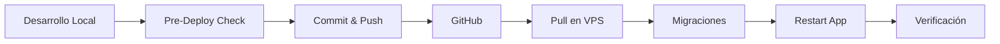

# 🚀 Guía Rápida de Despliegue

Esta guía te ayudará a sincronizar tu versión local con el VPS a través de GitHub.

## 📋 Situación Actual

- ✅ **Versión Local**: Actualizada y completa
- ⚠️ **Versión VPS**: Desactualizada
- 📊 **Base de Datos Local**: Más completa que la del VPS
- 🎯 **Objetivo**: Subir versión local → GitHub → VPS

---

## ⚡ Despliegue Rápido (3 Pasos)

### Paso 1: En tu Máquina Local (Windows)

```powershell
# Opción A: Usar el script automático (RECOMENDADO)
.\deploy_to_github.bat

# Opción B: Manual
python pre_deploy_check.py  # Verificar que todo está listo
git add .
git commit -m "feat: Actualización completa del sistema"
git push origin main
```

### Paso 2: En el VPS (Linux)

```bash
# Conectarse al VPS
ssh usuario@tu-vps-ip

# Navegar al proyecto
cd /ruta/a/tu/proyecto

# Opción A: Usar el script automático (RECOMENDADO)
bash deploy_on_vps.sh

# Opción B: Manual
sudo systemctl stop mipymesia
git pull origin main
source .venv/bin/activate
pip install -r requirements.txt
python db_migrations.py
sudo systemctl start mipymesia
```

### Paso 3: Verificar

```bash
# Ver estado del servicio
sudo systemctl status mipymesia

# Ver logs en tiempo real
sudo journalctl -u mipymesia -f

# Verificar base de datos
sqlite3 users.db "SELECT name FROM sqlite_master WHERE type='table';"
```

---

## 🛠️ Herramientas Incluidas

### Scripts de Despliegue

| Script | Descripción | Uso |
|--------|-------------|-----|
| `pre_deploy_check.py` | Verifica que todo está listo para desplegar | `python pre_deploy_check.py` |
| `deploy_to_github.bat` | Automatiza el push a GitHub (Windows) | `.\deploy_to_github.bat` |
| `deploy_on_vps.sh` | Automatiza el despliegue en VPS (Linux) | `bash deploy_on_vps.sh` |
| `export_db_schema.py` | Exporta esquema de la base de datos | `python export_db_schema.py` |
| `export_user_data.py` | Exporta/importa datos de usuarios | Ver abajo |
| `db_migrations.py` | Sistema de migraciones automáticas | `python db_migrations.py` |

### Gestión de Base de Datos

```bash
# Exportar datos de usuarios (para backup o migración)
python export_user_data.py export

# Exportar con nombre personalizado
python export_user_data.py export backup_20231202.json

# Comparar base de datos local con exportación del VPS
python export_user_data.py compare users_export_vps.json

# Importar datos (¡CUIDADO! - Solo si sabes lo que haces)
python export_user_data.py import users_export.json
```

---

## 📊 Sistema de Migraciones

El proyecto usa un sistema de migraciones automáticas que:

✅ Actualiza el esquema de la base de datos sin perder datos  
✅ Registra qué migraciones se han ejecutado  
✅ Se ejecuta automáticamente al iniciar la aplicación  
✅ Es seguro ejecutar múltiples veces (no duplica cambios)

### Migraciones Actuales

1. **001_subscription_system**: Sistema de suscripciones y límites
2. **002_tasks_system**: Sistema de tareas y gamificación

### Verificar Migraciones

```bash
# Ver migraciones ejecutadas
sqlite3 users.db "SELECT * FROM schema_migrations;"

# Ejecutar migraciones manualmente
python db_migrations.py
```

---

## 🔒 Seguridad

### Archivos que NO se suben a GitHub

El `.gitignore` está configurado para excluir:

- ✅ `.env` - Variables de entorno sensibles
- ✅ `*.db` - Bases de datos con información de usuarios
- ✅ `users_export*.json` - Exportaciones de datos
- ✅ Backups y archivos temporales

### Variables de Entorno Requeridas

Crea un archivo `.env` en el VPS con:

```env
OPENAI_API_KEY=tu_api_key_aqui
GOOGLE_SHEETS_ESTRATEGIAS_ID=tu_sheet_id_aqui
GOOGLE_SHEETS_NEGOCIOS_ID=tu_sheet_id_aqui
```

Ver `.env.template` para más detalles.

---

## 🆘 Solución de Problemas

### Error: "Database is locked"

```bash
# Detener la aplicación
sudo systemctl stop mipymesia

# Verificar procesos
ps aux | grep python

# Matar proceso si es necesario
kill -9 <PID>
```

### Error: Conflictos de Git

```bash
# Ver diferencias
git diff

# Guardar cambios locales
git stash

# Actualizar
git pull origin main

# Aplicar cambios guardados
git stash pop
```

### Error: Columnas faltantes en la base de datos

```bash
# Ejecutar migraciones
python db_migrations.py

# Verificar estructura
sqlite3 users.db ".schema users"
```

### Error: Servicio no inicia

```bash
# Ver logs detallados
sudo journalctl -u mipymesia -n 100 --no-pager

# Verificar permisos
ls -la users.db

# Verificar entorno virtual
which python
pip list
```

---

## 📝 Checklist de Verificación Post-Despliegue

Después de desplegar, verifica:

- [ ] La aplicación inicia sin errores
- [ ] Los usuarios existentes pueden iniciar sesión
- [ ] Se pueden generar estrategias
- [ ] El sistema de tareas funciona
- [ ] El panel de administración es accesible
- [ ] Los límites de suscripción funcionan correctamente
- [ ] No hay errores en los logs

---

## 📚 Documentación Adicional

- **DEPLOY.md**: Guía detallada paso a paso
- **database_structure.md**: Estructura completa de la base de datos (generado automáticamente)
- **database_schema.sql**: Esquema SQL completo (generado automáticamente)

---

## 🔄 Flujo de Trabajo Recomendado



1. **Desarrollo**: Trabaja en tu máquina local
2. **Verificación**: Ejecuta `pre_deploy_check.py`
3. **Push**: Sube cambios a GitHub
4. **Pull**: Descarga en VPS
5. **Migración**: Actualiza base de datos
6. **Restart**: Reinicia aplicación
7. **Verificación**: Confirma que todo funciona

---

## 💡 Consejos

1. **Siempre haz backup** antes de desplegar
2. **Usa los scripts automáticos** para evitar errores
3. **Verifica los logs** después de cada despliegue
4. **Mantén sincronizadas** las variables de entorno
5. **Documenta** cualquier cambio manual que hagas

---

## 📞 Soporte

Si encuentras problemas:

1. Revisa los logs: `sudo journalctl -u mipymesia -f`
2. Verifica el estado: `sudo systemctl status mipymesia`
3. Consulta DEPLOY.md para soluciones detalladas
4. Revisa que todas las variables de entorno estén configuradas

---

**Última actualización**: 2025-12-02
